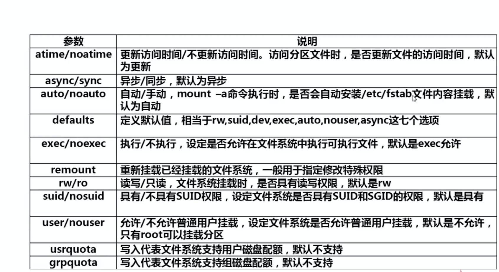

# Linux常用命令

## 命令基本格式
#### 命令提示符：
```  
[root@localhost~]#
其中：
    root：当前登陆用户
    localhost：主机名
    ～：当前所在目录（家目录）
    #：超级用户的提示符
       普通用户的提示符是$
```

#### 命令格式
```
命令 [选项][参数]
注意：个别命令使用不遵循此格式
    当有多个选项时可以写在一起
    简化选项与完成选项
        -a等于--all
```

#### 文件权限
```
-rw-r--r--
-：文件类型（- 文件 d 目录 l 软连接文件）
rw-：u所有者
r--：g所属组
r--：o其他人
r图 w写 x执行

```

```
ls [选项][文件或目录]
选项：
    -a 显示所有文件包括隐藏文件
    -l 显示详细信息
    -d 查看目录属性
    -h 人性化显示文件大小
    -i 显示inode
```

## 文件处理命令
#### 目录、文件处理命令
```
建立目录
mkdir -p [目录名]
-p 递归创建
```
```
切换所在目录
cd [目录]
```
```
查询所在目录位置
pwd
```
```
删除空目录
rmdir [目录名]
```
```
删除文件或目录
rm -rf [文件或目录]
-r 删除目录  
-f 强制
```
```
复制命令
cp [选项][原文件或目录][目标目录]
-r 复制目录  
-p 连带文件属性复制
-d 若源文件是链接文件，则复制链接属性
-a 相当于-pdr
```
```
剪切或改名
mv [原文件或目录][目标目录]
```
```
常用目录作用  
/根目录  
/bin命令保存目录  
/boot启动目录，启动相关文件  
/dev设备文件保存目录  
/home普通用户的家目录  
/lib系统库保存目录  
/mnt系统挂载目录  
/media挂载目录 

/root超级用户的家目录
/tmp临时目录
/sbin命令保存目录（超级用户才能使用）
/proc直接写入内存的
/sys
/usr系统软件资源目录
    /usr/bin系统命令（普通用户）
    /usr/sbin系统命令（超级用户）
/var系统相关文档内容
```

#### 链接命令
```
生产链接文件  
ln -s [原文件][目标文件]  
-s 创建软连接  

硬链接特性
1 拥有相同的i节点和存储block块，可以看做同一个文件
2 可以通过i节点识别
3 不能跨分区
4 不能针对目录使用

软链接特征
1 类似Windows快捷方式  
2 软链接拥有自己的i节点和block块，但是数据块中只保留原文件的文件名和I节点号，并没有实际的文件数据
3 lrwxrwxrwx l软链接 软链接文件权限都为rwxrwxrwx
4 修改任意文件，另一个都改变
5 删除原文件，软链接不能使用

```

## 文件搜索命令
* 文件搜索命令locate
* 命令搜索命令whereis与which
* 文件搜索命令find
* 字符串搜索命令grep
* find命令与grep命令的区别

```
文件搜索
locate 文件名  
在后台数据库中按文件名搜索，搜索速度更快  
/var/lib/mlocate
#locate命令所搜索的后台数据库
updatedb更新数据库
/etc/updatedb.conf配置文件
```
```
搜索命令的命令
whereis 命令名
# 搜索命令所在路径及帮助文档所在位置
-b: 只查找可执行文件
-m: 只查找帮助文件
```
```
文件搜索
find [搜索范围][搜索条件]
find / -name install.log
# 避免大范围搜索，会非常耗费系统资源
# find是在系统中搜索符合条件的文件名。如果需要匹配，使用通配符匹配，通配符是完全匹配
* 匹配任意内容
? 匹配任意一个字符
[] 匹配任意一个中括号内的字符

-iname 不区分大小写
-user 按照所有者搜索 find /root -user root
-nouser 查找没有所有者的文件 find /root -nouser

find /var/log/ -mtime +10
# 查找10天前修改的文件
-10 10天内修改的文件
10  10天当天修改的文件
+10 10天前修改的文件
atime 文件访问时间
ctime 改变文件属性
mtime 修改文件内容

find . -size 25k
# 查找文件大小是25kb的文件
-25k 小于25kb的文件
25k  等于25kb的文件
+25k 大于25kb的文件

find . -inum 262422
# 查找i节点是262422的文件

find /etc -size +20k -a -size -50k
# 查找etc目录下，大于20kb并且小于50kb的文件
-a and 逻辑与
-o or 逻辑或

find /etc -size +20k -a -size -50k -exec ls -lh {} \;
# 查找etc目录下，大于20kb并且小于50kb的文件,并显示详细信息
# -exec/-ok 命令 {}\;对搜索结果进行操作
```
```
搜索字符串命令
grep [选项] 字符串 文件名
# 在文件当中匹配符合条件的字符串，如果需要匹配使用正在表达式进行匹配，正在表达式是包含匹配
-i 忽略大小写
-v 排除指定字符串
```

## 帮助命令
```
帮助命令
man 命令
# 获取指定命令的帮助

man ls
# 查看ls的帮助

man命令的级别
1 查看命令的帮助
2 查看可被内核调用的函数的帮助
3 查看函数和函数库的帮助
4 查看特殊文件的帮助（主要是/dev目录下的文件）
5 查看配置文件的帮助
6 查看游戏的帮助
7 查看其他杂项的帮助
8 查看系统管理员可用命令的帮助
9 查看和内核相关文件的帮助

查看命令拥有哪个级别的帮助
man -f 命令
相当于
whatis
举例
man -5 passwd
man -4 null
man -8 ifconfig

查看和命令相关的所有帮助
man -k 命令
相当于
apropos 命令
```
```
选项帮助
命令 --help
# 获取命令选项帮助

shell内部命令帮助
help shell 内部命令
# 获取shell内部命令的帮助
例如
whereis cd 
# 确定是否是内部命令
help cd 
# 获取内部命令帮助

详细命令帮助
info 命令
-回车 进入字帮助页面（带有*号标记）
-u   进入上层页面
-n   进入下一个帮助细节
-p   进入上一个帮助细节
-q   退出
```

## 压缩与解压命令
常有压缩格式  
* .zip .gz .bz2
* .tar.gz .tar.bz2

```
zip格式压缩
zip 压缩文件名 源文件
# 压缩文件
zip -r 压缩文件名 源目录
# 压缩目录

zip格式解压缩
unzip 压缩文件
```
```
.gz格式压缩
gzip 源文件
# 压缩为.gz格式的压缩文件，源文件会消失
gzip -c 源文件 > 压缩文件
# 压缩为.gz格式，源文件保留
gzip -r 目录
# 压缩目录下所有子文件，但是不能压缩目录

.gz格式解压缩
gzip -d 压缩文件
gunzip 压缩文件
```
```
.bz2格式压缩
bzip2 源文件
# 不保留源文件
bzip2 -k 源文件
# 保留源文件
# 注意bzip2命令不能压缩目录

.bz2格式解压缩
bzip2 -d 压缩文件
# -k保留压缩文件
bunzip 压缩文件
# -k保留压缩文件
```
```
.tar.gz压缩格式
.tar.gz格式是先打包为.tar格式，再压缩为.gz格式
tar -zcvf 压缩包名.tar.gz 源文件
选项
    -z 压缩为.tar.gz格式
tar -zxcf 压缩包名.tar.gz
选项
    -x 解压缩.tar.gz格式

.tar.bz2压缩格式
.tar.bz2格式是先打包为.tar格式，再压缩为.bz2格式
tar -jcvf 压缩包名.tar.bz2 源文件
选项
    -j 压缩为.tar.bz2格式
tar -jxcf 压缩包名.tar.bz2
选项
    -x 解压缩.tar.bz2格式
```

## 关机和重启命令
```
关机重启
shutdown [选项] 时间
-c 取消前一个关机命令
-h 关机
-r 重启
```
```
系统的运行级别
0  关机
1  单用户
2  不完全多用户，不含NFS服务
3  完全多用户
4  未分配
5  图形界面
6  重启
init 6
cat /etc/inittab
# 修改系统默认运行级别
id:3:initdefault
runlevel
# 查询系统运行级别
```

## 其他常用命令
#### 挂载命令
```
查看系统中已挂载的设备
mount

mount -a
# 依据配置文件/etc/fstab的内容，自动挂载

挂载命令格式
mount [-t 文件系统] [-o 特殊选项] 设备文件名 挂载点

选项：
-t 文件系统：加入文件系统类型来指定挂载的类型，可以ext3、ext4、iso9660等文件系统
-o 特殊选项：可以指定挂载的额外选项
```


```
挂载步骤
1 指定挂载点
mkdir /mnt/cdrow

2 挂载光盘
mount -t iso9660 /dev/sr0 /mnt/cdrow
```
```
卸载命令
umount 设备文件名或挂载点
```
```
查看设备文件名
fdisk -l
```